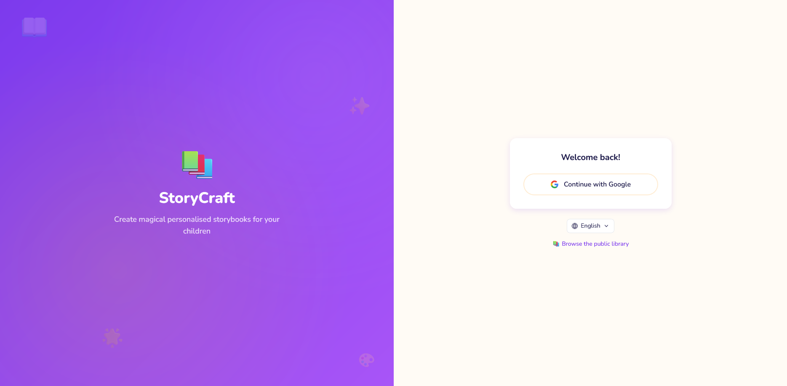
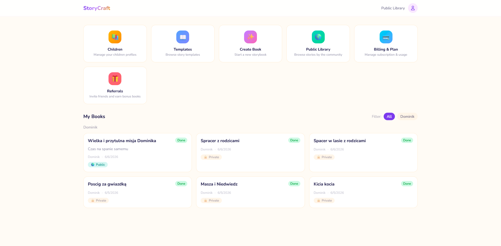
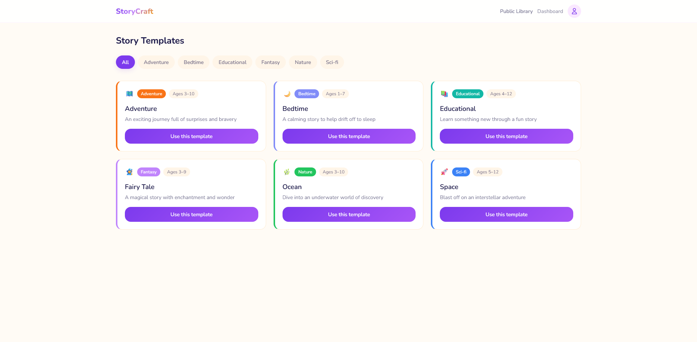
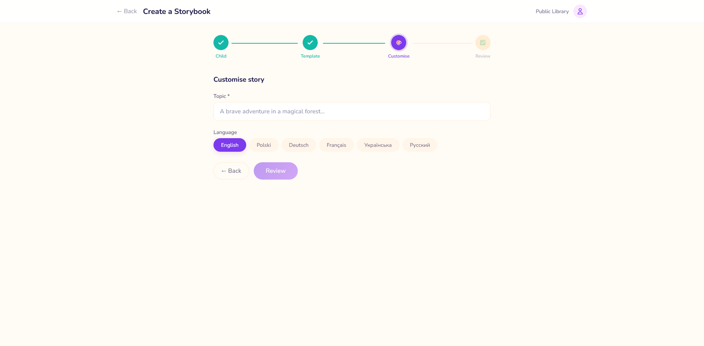
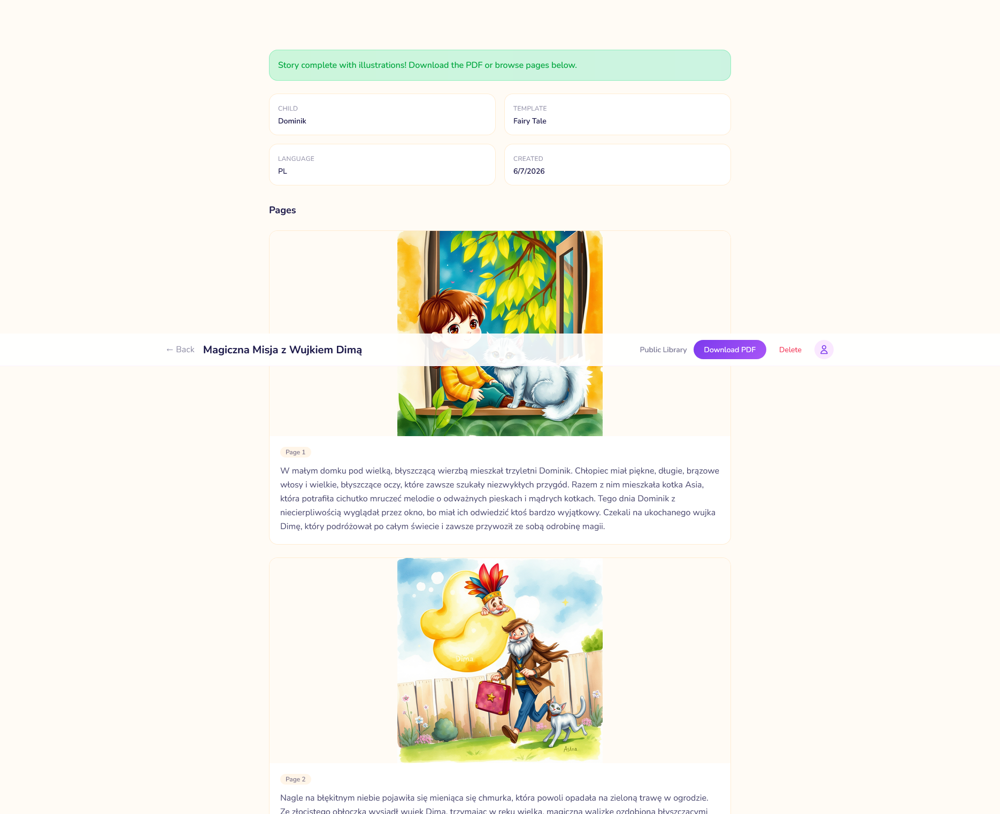
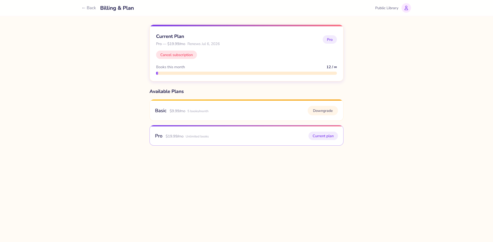

# StoryCraft

AI-powered personalized children's storybook platform. Parents enter child details + topic, and the app generates an illustrated story PDF via AI.

## Screenshots

| Login | Dashboard |
|---|---|
|  |  |

| Template selection | Book creation |
|---|---|
|  |  |

| Book detail | Billing |
|---|---|
|  |  |

## Quick start

```bash
# 1. Copy env templates
cp backend/.env.dist backend/.env
cp frontend/.env.dist frontend/.env

# 2. Edit backend/.env — fill in your API keys

# 3. Start
docker compose up -d --build

# 4. Generate JWT keys
docker compose exec php-fpm mkdir -p config/jwt
docker compose exec php-fpm openssl genrsa -out config/jwt/private.pem 4096
docker compose exec php-fpm openssl rsa -in config/jwt/private.pem -pubout -out config/jwt/public.pem

# 5. Setup database
docker compose exec php-fpm php bin/console doctrine:migration:migrate -n
docker compose exec php-fpm php bin/console doctrine:fixtures:load -n

# 6. Open http://localhost
```

## Environment variables

See `backend/.env.dist` and `frontend/.env.dist` for all required variables.

Key variables to configure:
- `GOOGLE_CLIENT_ID` / `GOOGLE_CLIENT_SECRET` — Google OAuth ([setup guide](https://console.cloud.google.com/))
- `GEMINI_API_KEY` — Gemini AI for story generation
- `CF_ACCOUNT_ID` / `CF_API_TOKEN` — Cloudflare Workers AI for illustrations
- `STRIPE_SECRET_KEY` / `STRIPE_WEBHOOK_SECRET` — Stripe billing

## Commands

```bash
# Run tests
docker compose exec php-fpm php bin/phpunit
docker compose exec frontend npm test

# Retry failed jobs
docker compose exec php-fpm php bin/console app:retry-story <bookId>
docker compose exec php-fpm php bin/console app:retry-illustrations <bookId>

# View logs
docker compose exec php-fpm tail -f var/log/dev.log

# Rebuild after dependency changes
docker compose up -d --build
```

## Production deployment

```bash
# 1. Copy env templates
cp .env.example .env
cp frontend/.env.dist frontend/.env

# 2. Edit .env — set production values
#    - APP_ENV=prod, APP_SECRET=<random>, APP_FRONTEND_URL=https://your-domain
#    - POSTGRES_DB, POSTGRES_USER, POSTGRES_PASSWORD (strong passwords!)
#    - REDIS_PASSWORD
#    - S3_KEY, S3_SECRET (MinIO credentials)
#    - All API keys (Gemini, Cloudflare, Stripe, Google OAuth)
#    - S3_PUBLIC_URL=https://your-domain/minio (or your CDN URL)

# 3. Deploy
make prod-up

# 4. Generate JWT keys
docker compose -f docker-compose.prod.yml exec php-fpm mkdir -p config/jwt
docker compose -f docker-compose.prod.yml exec php-fpm openssl genrsa -out config/jwt/private.pem 4096
docker compose -f docker-compose.prod.yml exec php-fpm openssl rsa -in config/jwt/private.pem -pubout -out config/jwt/public.pem

# 5. Run migrations
make prod-migrate

# 6. Open http://your-domain
```

### Production Make commands

| Command | Description |
|---|---|
| `make prod-up` | Build and start all production containers |
| `make prod-down` | Stop all production containers |
| `make prod-logs` | Tail production logs |
| `make prod-migrate` | Run database migrations |
| `make prod-worker` | Tail worker logs |
| `make prod-shell-api` | Open shell in php-fpm container |
| `make prod-restart` | Force rebuild and restart all containers |

### Production checklist

- [ ] Strong passwords for PostgreSQL and Redis
- [ ] MinIO credentials changed from defaults
- [ ] `APP_SECRET` set to a random string
- [ ] `APP_ENV=prod` in `.env`
- [ ] `APP_FRONTEND_URL` points to your real domain
- [ ] `S3_PUBLIC_URL` points to publicly accessible storage endpoint
- [ ] JWT passphrase changed from default
- [ ] SSL/TLS termination configured (e.g. Cloudflare, nginx, Caddy)
- [ ] Google OAuth redirect URI updated to production domain
- [ ] Stripe webhook endpoint configured for production URL

## Tech stack

- **Backend:** Symfony 8.1 (PHP 8.4), PostgreSQL, Redis, MinIO
- **Frontend:** React 19, TypeScript, Vite, Tailwind CSS
- **AI:** Gemini (story), Cloudflare Workers AI (illustrations)
- **Payments:** Stripe Checkout + Subscriptions
- **Auth:** Google OAuth2 + JWT
